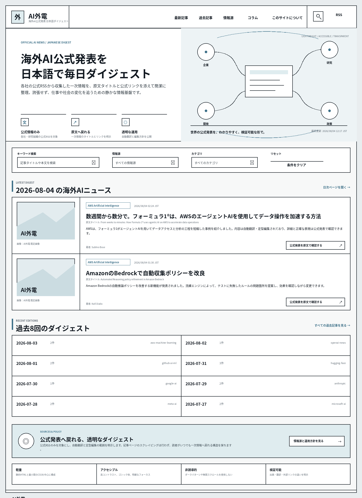

# AI外電 デザイン改修ポリシー

更新日: 2026-08-04

## 位置づけ

この文書は、AI外電の今後のデザイン改修で優先する判断基準を定める。

下記のコンセプト画像は、レイアウトと空気感を共有するための参考イメージであり、完成画面をそのまま再現するための仕様書ではない。実装時に画像とポリシーが衝突する場合は、この文書に記載したポリシーを優先する。

## コンセプト画像

### 初期コンセプト

### Product Design反映案

## 1. デザインの基本思想

AI外電を、海外AI企業や研究組織の公式発表を静かに整理する、信頼性の高い情報メディアとして見せる。

目指す印象は次のとおり。

- 国際的な公共情報サイトや編集媒体のような、落ち着きと明快さ
- 罫線、面、余白、グリッドによって情報を整理する構成
- 派手さよりも可読性、透明性、再訪しやすさを優先する
- AIを過度に神秘化したり、未来感を演出しすぎたりしない
- 自動収集・自動翻訳サイトであることを隠さず、誠実に伝える

## 2. 視覚設計

### 2.1 色

- 白、薄いグレー、黒を基調とする
- 差し色は、くすんだ青または淡い青灰色を中心に1色程度へ絞る
- 必要に応じて、ごく少量の落ち着いた緑を補助色として使ってよい
- 高彩度色を複数同時に使わない
- 色だけで状態や意味を伝えない

### 2.2 線と面

- セクション、カード、検索欄、ナビゲーションは、共通の罫線ルールで統一する
- 線幅、角の処理、余白の基準をデザイントークンとして定義する
- 不要な角丸、影、グラデーション、装飾枠を避ける
- 面と線の開始位置を揃え、セクションごとに別々のルールを作らない
- ボックスを増やしすぎず、罫線と余白で構造を示す

### 2.3 タイポグラフィ

- 見出し、本文、補助情報の階層を明確にする
- 日本語本文は長時間読んでも疲れにくいサイズと行間を確保する
- Webフォントの追加は原則避け、システムフォントを優先する
- 本文、ナビゲーション、ボタン、フォームなど、情報理解と操作に直結する箇所は、日本語ゴシック体を第一候補として検討する
- 明朝体を採用する場合は、ブランド表現や大見出しなど限定的な用途を基本とし、小さい文字や長文本文では可読性を確認する
- ゴシック体か明朝体かだけでアクセシビリティを判断せず、文字サイズ、ウェイト、行間、字間、コントラスト、拡大表示時の読みやすさを合わせて評価する
- macOS、Windows、iOS、Androidの主要なシステムフォントと描画差を確認し、特定環境で細すぎる、潰れる、読みづらい状態を避ける
- 実装前後に、本文と見出しのフォント候補を実際のニュース本文で比較し、低視力者を含む読みやすさ、長文の疲れにくさ、情報階層の分かりやすさを確認する
- 英字ラベルは補助的に使い、日本語の意味理解を妨げない
- メタデータを細かく並べすぎず、重要度の低い情報はまとめる

## 3. トップページの構成方針

### 3.1 ヘッダー

- 左側にAI外電のロゴと短い説明を置く
- 右側に過去記事、情報源、コラム、このサイトについて、検索への導線を置く
- ナビゲーションはキーボード操作可能にする
- モバイルでは無理に横一列を維持せず、明快なメニューへ変形する

### 3.2 ヒーロー

- 左右2分割を基本とする
- 左側にサイトの目的、短い説明、特徴を置く
- 右側は、世界の公式情報を集める構造が伝わる抽象図、または軽量な情報パネルとする
- 装飾画像は内容理解を補助する範囲に留める
- 動画背景や重いアニメーションは使わない

### 3.3 特徴表示

次の価値が一目で分かるようにする。

- 公式情報のみを対象にする
- 原文リンクを併記する
- 透明性、簡潔さ、継続性を重視する

### 3.4 検索と絞り込み

- キーワード、情報源、カテゴリなどを一つの整理された領域にまとめる
- 入力欄、選択欄、リセット操作の線、面、余白を統一する
- ラベルを省略せず、スクリーンリーダーでも意味が分かる構造にする
- 絞り込みが未実装の段階では、見た目だけの操作部品を置かない

### 3.5 最新ダイジェスト

- 各記事は、画像または代替ビジュアルと本文を整理した簡潔な2カラム構成を基本とする
- 配信元、公開日時、見出し、原文タイトル、短報、公式リンクの優先順位を明確にする
- 小さなバッジやメタ情報を増やしすぎない
- カード同士の余白、線、画像位置、ボタン位置を揃える
- 公式発表へのリンクは、広告や内部リンクと誤認しない表現にする

### 3.6 過去ダイジェスト

- トップページでは過去8回を表示する
- PCでは左右2列、4行の均等なグリッドを基本とする
- 互い違い、段違い、サイズ違いのカード配置は避ける
- 日付、件数、主な情報源を簡潔に表示する
- モバイルでは1列へ自然に落とす

### 3.7 情報源とポリシー

- 公式RSSのみを使うこと、自動翻訳であること、原文確認を推奨することを短く明示する
- トップページでは簡潔に示し、詳細は情報源・運用方針ページへ分離する
- 過度に大きな注意書きで本文閲覧を妨げない

## 4. サステナブルな実装

持続可能性を、見た目のテーマではなく実装判断に反映する。

- Astroによる静的HTML生成を維持する
- 不要なJavaScriptや大型UIライブラリを追加しない
- CSSで実現できる表示にJavaScriptを使わない
- 画像は表示サイズに合わせて最適化し、必要なものだけを読み込む
- Webフォント、動画背景、常時動くアニメーションを避ける
- 新着がない場合に不要なコンテンツ生成やデプロイを行わない現在の設計を維持する
- 外部埋め込みは必要最小限とし、遅延読み込みや通常リンクの併記を検討する
- Spotifyを設置する場合は、代表作品またはプレイリストを原則1件に限定する

## 5. アクセシビリティ

アクセシビリティは後付けの検査項目ではなく、初期設計の条件とする。

- WCAGを参考に十分な文字色コントラストを確保する
- 見出し階層、ランドマーク、リスト、ボタン、リンクを意味に沿ったHTMLで実装する
- キーボードだけで主要な操作を完了できるようにする
- フォーカス位置を常に視認できるようにする
- アイコンだけの操作には、視覚ラベルまたはアクセシブルネームを付ける
- 画像には内容に応じた代替テキストを設定し、装飾画像は読み上げ対象から外す
- `prefers-reduced-motion`を尊重する
- タップ領域を十分に確保する
- PC、タブレット、スマートフォンで本文の読みやすさを維持する
- 音声操作を独自実装するより、ブラウザや支援技術が正しく解釈できる構造を優先する

## 6. 倫理的なUI

- ダークパターンを使用しない
- 閉じにくいポップアップ、強制的な登録、紛らわしいボタンを置かない
- 広告、Spotify、関連リンク、記事本文を明確に区別する
- 自動翻訳、AI執筆、広告、外部埋め込みを隠さない
- Cookieや外部通信が発生する場合は、プライバシーポリシーへ正確に反映する
- 無限スクロールで閲覧を拘束せず、ページ構造と現在位置を理解できるようにする
- 読者を煽る表現や、実際の内容と異なるクリック誘導を避ける

## 7. 視覚的ノイズの削減

- 一画面内の主役を明確にする
- 色、罫線、ラベル、アイコンの種類を増やしすぎない
- 同じ意味を複数の装飾で重ねて表現しない
- 余白を情報構造の一部として使う
- 長い説明は詳細ページへ分離する
- 最新記事より下の領域も、ヒーローや検索欄と同じグリッド、線幅、余白基準に合わせる

## 8. レスポンシブ方針

- デスクトップの縮小版をスマートフォンへ押し込まない
- 2カラムは必要に応じて1カラムへ変更する
- ヒーロー、記事カード、過去8回の一覧は、読む順序が自然になるように縦積みする
- 表示順とDOM順を大きく食い違わせない
- 横スクロールを前提にしない

## 9. 実装時の優先順位

1. セマンティックHTMLと情報階層
2. アクセシビリティと読みやすさ
3. 軽量性と表示速度
4. グリッド、罫線、余白の統一
5. 色とビジュアル表現
6. 装飾や演出

## 10. 受け入れ条件

- ライトテーマで、白・薄灰・黒・控えめな差し色に整理されている
- 線幅、余白、角、ボタン、入力欄のルールが共通化されている
- 本文と操作UIのフォントはゴシック体を第一候補として比較し、主要OSと拡大表示で読みやすさを確認している
- 明朝体を使う場合は用途を限定し、本文の可読性を損なっていない
- トップページの過去ダイジェストが過去8回になっている
- PCでは過去8回が均等な2列グリッドで表示される
- 最新ダイジェスト以下も、上部と同じ面・線・グリッドの考え方で整理されている
- キーボード操作、フォーカス表示、見出し階層、代替テキストを確認できる
- 不要なJavaScript、大型依存、重い画像、動画背景を追加していない
- 自動翻訳、公式情報、外部リンク、広告または外部埋め込みの区別が明確である
- Lighthouseの既存目標を損なわない

## 11. コンセプト画像の扱い

コンセプト画像から参考にするのは、主に次の要素である。

- ヘッダーとヒーローの明快な分割
- 罫線と面による情報整理
- 広い余白
- 抑制された配色
- 検索・絞り込み領域のまとまり
- 最新記事の簡潔な2カラム
- 過去8回の均等な2列配置

画像内の文字、寸法、線幅、個別のアイコン、記事内容、表示順を完全に再現する必要はない。実データ、既存機能、アクセシビリティ、表示速度、保守性に合わせて調整する。